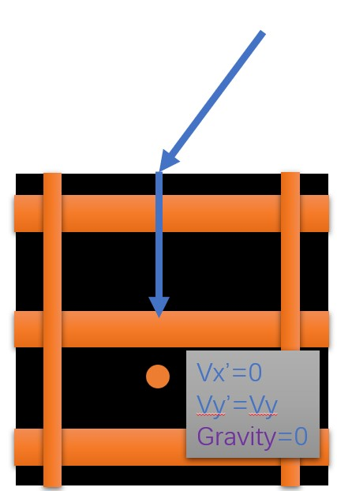

# gizmo

该项目实现了一个简单的弹球游戏，使用`java swing`界面工具库以及相关的事件监听器控制游戏的进行，通过每10微秒刷新一次界面实现游玩界面的动态演进过程。


## 游戏界面


### 导航栏


组件栏可控制以下功能

|  导航   | 功能  |
|  ----  | ----  |
| 打开  | 读取保存的文件 |
| 保存  | 将界面元素保存至文件 |
| 清空  | 清空界面 |
| 退出  | 关闭游戏 |

### 组件栏


组件栏可控制以下功能

|  组件   | 功能  |
|  ----  | ----  |
|   | 获取对象，用于改变组件 |
|   | 游戏所用的弹球 |
|   | 弹球掉入黑洞则游戏结束 |
|   | 三角形组件，碰撞会反弹 |
|   | 圆形组件，碰撞会反弹 |
|   | 正方形组件，碰撞会反弹 |
|   | 直轨道，进入后会以不变的速度驶出 |
|   | 弯轨道，改变小球方向，但不改变速度大小 |
|   | 左托盘，可以受到`A`和`D`键控制 |
|   | 右托盘，可以受到`←`和`→`键控制 |

### 工具栏


工具栏可控制以下功能

|  工具   | 功能  |
|  ----  | ----  |
|   | 旋转组件 |
|   | 删除组件 |
|   | 放大组件 |
|   | 缩小组件 |

### 模式栏


模式栏可控制以下功能

|  模式   | 功能  |
|  ----  | ----  |
| create mode  | 进入设计模式 |
| play mode  | 进入游玩模式 |

### 游戏区域（20*20）


## 设计模式

### 添加组件


### 改变组件


### 读取清空与保存


## 游玩模式

### 游戏开始


### 游戏结束


## 游戏目的

布置好场景开始游玩，通过利用组件的特性和平台的移动，使小球成功运动到黑洞中，则游戏成功。

## 界面介绍


场景里每个组件大小都是40乘40像素，每一个格子也是40*40像素，刚好组件都放置在格子内。整个界面的格子坐标与
像素点坐标对应图如下


在格子标号为0的点中存放了空气墙，（空气墙的朝向1在上面，2在下面，3在左面，4在右面）空气墙分别布置在四周，一碰撞小球就会反弹，保证小球不会离开界面。
（空气墙不会显示在游玩的界面之中，超出了画面之外）


小球在运动时的矢量选取如图所示

```
X：小球x坐标（朝右为正）
Y：小球y坐标（朝下为正）
Vx：小球x轴速度（朝右为正，每一帧增加到X坐标长度中）
Vy：小球y轴速度（朝右为正，每一帧增加到Y坐标长度中）
Gravity：小球所受重力（为一个固定值，方向向下，每一帧增加到Y轴速度中）
```

## 碰撞逻辑

小球会在每一帧的更新中检测碰撞，而每个组件有自己的碰撞方法。
在小球运动过程中，我们维护了小球边缘的16个点。


在每一帧更新这16个点的位置（通过圆心位置找到，三角函数值有一定的四舍五入），
判断这16个点在下一帧是否会与组件相碰撞（是否进入了组件所在的格子内），若某一个点被检测出 
会碰撞（称其为碰撞点），则找到被碰撞的组件对象，调用该组件的碰撞方法。即把碰撞点位置传给组件，
让不同的组件用符合组件形状的几何方法计算出碰撞后小球应有的速度，返回给小球。小球接收碰撞后组件更新的速度信息，从而正确地控制出小球碰撞后的运动轨迹。

其中各个组件计算碰撞的方式如下（黄色圆圈表示碰撞点，蓝色箭头表示小球运动轨迹方向）

|  组件   | 碰撞检测  |  更新速度方法 | 在图中碰撞发生的速度约束 | 图示说明  |
|  ----  | ----  | ----| ----|----|
|  正方形  | 若进入所在格子则发生碰撞，比较h1，h2，h3，h4的大小，例如在图中h1最小，则判断为与上表面相碰撞  | 判断与哪个面相碰撞后，将对应速度反向后返回| `Vy > 0` | |
|  三角形 | 若进入所在格子，检测是否h1+h2<H，为真则发生碰撞，否则未碰撞。比较h1，h2，H-h1-h2的大小，例如在图中后者最小，则判断为与斜面相碰撞| 将速度分量交换后返回，注意正负方向| `(Vx > 0 and Vy > 0 and Vy > Vx) or (Vx < 0 and Vy < 0 and Vy > Vx) or (Vx <= 0 and Vy >= 0)` | |
|  圆形 | 若进入所在格子，检测是否h1×h1+h2×h2<r×r，为真则发生碰撞，否则未碰撞。  | 通过角度计算出碰撞后的相应速度，返回| `Vycosθ - Vxsinθ > 0`| |
|  平台  | 若进入所在格子，检测是否h1>h2，为真则发生碰撞，否则未碰撞。  | 将竖直方向速度反向后返回|`Vy > 0`| |
|  直轨道  | 通过正方形的方式判断进入轨道还是反弹，如图上下进入，左右反弹 | 若进入轨道，取消重力直到不再碰撞，取消横向轨道速度，返回；若反弹，将对应速度反向后返回|`Vy > 0`| |
|  弯轨道 | 通过正方形的方式判断进入轨道还是反弹，如图左下进入，右上反弹  | 若进入轨道，取消重力直到不再碰撞，取消横向轨道速度，判断是否有h2<h1，是则改变速度方向，否则维持原方向速度；若反弹，将对应速度反向后返回|`Vx > 0`| |

## 遇到的困难

* 在需求分析和设计阶段过程中，我们不可避免地会讨论到技术实现，由于游戏的游玩过程包括碰撞方式的技术选型没有定下来，导致
我们并没有立即能够讨论出结果，项目的进行暂时地进入了瓶颈期。这个问题在我们了解了gui的实现可能性，定下游戏的实现方式（成为了领域专家）后得到了解决。
* 此次课程项目功能较为离散，无法统一成为一整个的业务流程。这一点让我们无法在设计阶段时提供一个囊括整个软件的顺序图。由于
功能需求大多为监听响应机制，即收到某个鼠标键盘操作完成对应的要求，这让我们很难视其为统一的过程进行分析和考虑。
* 在游戏的要求中，小球始终需要摆放在游戏界面里所有元素的最上层。由于在一开始gui的实现中并没有找到相应的方法，陷入了这个难题中，在会后理解gui图层叠放次序原理后得到解决。
* 在gui中的每个panel面板中，我们可以按照相应的布局摆放每个组件的位置。然而在其提供的表格布局中，表格的列宽与行高并没有设置的方法。这使我们的组件栏和单选框并没有调整到最为合适的长宽比上。
* 几何图形的碰撞几何计算设置较为复杂，例如在圆的碰撞实现中涉及到分量的三角分解和二元一次方程的求解，在查阅相关论文和资料后才得以在代码上解决。
* 小球进入弯轨道时并不会随着轨道做弧度的运动，这点可能考虑使用动画实现的方式，将会在接下来的更新中加以完善。
* 在游玩模式中，由于我们的演进过程是靠10微秒一次的界面刷新实现的，所以在一些机器中可能会出现显示不全就被刷掉的情况，具体表现为小球不完整。这个我们会在后期优化过程中考虑实现改进方案。
* 在某些极端的碰撞情况可能会导致某些小球运动的bug出现。这可能是由于像素的误差以及检测的时延等问题综合导致的。
* 在每一帧检测小球边缘的碰撞点时，不可避免地会有先后顺序问题，也就是检测到的点可能不是小球上第一个与组件发生碰撞的点，可能有多个点碰撞但我们只取了检测到的第一个。这会导致一些误差甚至bug的出现，在目前阶段并没有解决。
* 由于我们的碰撞逻辑本身只是逐帧的检测，可能会发生小球速度过快导致的一帧内跳过组件的问题，这种情况下不会发生碰撞，在我们的实现方法中夜无法解决该问题。
* 多个平台如果同时响应键盘移动会有先后检测的bug，可能出现一个平台被另一个平台挡住的情况。
* 在这个版本中，按照课程演示文件的要求，我们未实现将组件叠放以及多个小球同时游戏的功能，但都留有相应的改变接口，若今后有改变的需求也将非常容易实现。
* 在gui以及响应多线程的过程中，我们使用到了多个内部类、工具类以及lambda表达式传类等方式。这些特殊的函数式方法并不适宜在类图中逐一表示，经过我们的小组讨论，我们将实现的大意提取出来以方法的形式表现在了类图之中。

[comment]: <> (## 演示结果)

[comment]: <> (![avatar]&#40;./untitled/img/11.jpg&#41;)

[comment]: <> (![avatar]&#40;./untitled/img/22.jpg&#41;)

[comment]: <> (![avatar]&#40;./untitled/img/33.jpg&#41;)

[comment]: <> (![avatar]&#40;./untitled/img/44.jpg&#41;)

[comment]: <> (![avatar]&#40;./untitled/img/游玩模式.mp4&#41;)

[comment]: <> (![avatar]&#40;./untitled/img/布局模式.mp4&#41;)

[comment]: <> (![avatar]&#40;./untitled/img/文件系统.mp4&#41;)